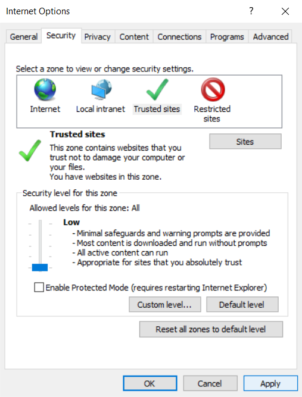

# Map cyconnect (SharePoint) as a Network Drive

If you have trouble with these steps, read [Troubleshoot mapped network drives that connect to SharePoint Online](https://docs.microsoft.com/en-us/sharepoint/troubleshoot/administration/troubleshoot-mapped-network-drives).

1. Open **Internet Explorer** (you must use this browser).

2. Navigate to https://cityyear.sharepoint.com/teams/chi

3. Sign in, and be sure to select "Remember Me", "Do not challenge me on this device again", and "Stay Signed In".

4. Open `Tools -> Internet Options`.

    

5. Under `Security`, click `Trusted Sites`, then click the `Sites` button.

    

6. Add the following sites and click `Close`.
    * `https://*.sharepoint.com`
    * `https://*.microsoftonline.com`
    * `https://*.microsoft.com`
    * `https://cityyear.sharepoint.com`

7. Back in the Internet Options window, drag the slider to set security to `Low`. Then click `Apply` and `Okay`.

    

8. Back on SharePoint, navigate to a document library. Under `All Documents` choose `View in file Explorer`. Choose to allow all pop-ups if necessary.

    

9. The scripts in this project should now run smoothly. You may need to periodically log in again to SharePoint in the Internet Explorer browser to refresh your credentials.
